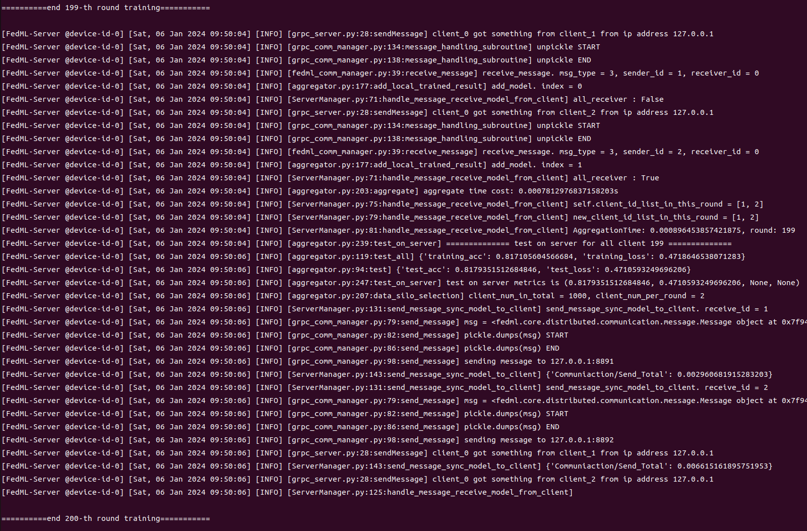

# 联邦学习
## 实验
### 实验内容

分别使用 FedML、Flower、FedScale、FederatedScope，实现联邦平均（FedAvg）算法

实现的算法应包括以下功能
- 在服务端使用随机客户端选择策略
- 对各客户端模型采取加权平均的聚合方式，权重与客户端的数据量成正比
- 支持按比例（例如0.1）或者按数量（例如10个）配置单轮客户端选择规模（支持在联邦学习启动时进行一次性配置即可；如同时指定两种配置，忽略其中一种）
- 支持在每轮当中单独配置各个客户端的本地epoch次数（例如每个客户端前2次被选中时每次执行2个epoch，后续每次被选中时执行1个epoch）
- 每轮结束后在服务端测试全局模型，并报告测试集上的精度（print或写日志等均可，可利用框架内提供的相关API）

注意事项
- 只需实现一个包含上述功能的最小系统（能够在各自框架上运行），不要添加其他功能，以免影响后续比较
- 尽量保持联邦学习流程的逻辑和模型训练的逻辑的解耦
- 不要使用其提供的现成算法实现，请假定FedAvg未被这些框架支持（例如在Flower中封装了FedAvg这一Strategy，请修改该实现以包含所需功能并剔除多余功能，或者使用Strategy接口自己实现一遍）
- 可以使用任何模型和数据集，但尽量简单，能运行即可，并适当兼顾可配置性
- 使用面向边缘环境的API，不要使用仅面向模拟的API；但运行时可以只在本地开多个节点模拟

交付物
- 每个框架的FedAvg实现代码及相应的启动脚本（最好简要说明用法；不要提交整个仓库）
- 每个框架的FedAvg运行结果（请确保功能正确实现）

### fedml
#### 启动方式


方式一 client/server分别启动

首先配置文件在`conf`目录下， 配置`conf/fedml.yaml`

然后在`fml/server`目录下先启动server
```shell
python server.py --cf ../../conf/fedml.yaml --rank 0 --role server
```

然后在`fml/client`目录下再启动client
```shell
python client.py --cf ../../conf/fedml.yaml --rank 1 --role client
```
```shell
python client.py --cf ../../conf/fedml.yaml --rank 2 --role client
```
就可以了。

方式二 脚本启动

本仓库提供driver脚本启动方式，与方式一不同的是需要配置两个文件，一个是`conf`目录下，配置`conf/fedml.yaml`， 另一个是`conf/fedml_conf.yaml`

前者是fedml的固定配置文件，后者是启动配置文件。

接着运行
```shell
python driver.py start ./conf/fedml_conf.yaml
```

#### 运行结果

<p align="center">

</p>
<p></p>

如果是方式二的运行结果，可以在`log/fedml` 下查看server和client的日志。

TODO： 给出server端测试集上的精度图

### flower
#### 启动方式

本仓库提供driver脚本启动方式，与fedml不同的是，只需要一个配置文件`conf/flwr_conf.yaml`， 然后启动driver脚本即可
```shell
python driver.py start ./conf/flwr_conf.yaml
```

#### 运行结果

如果是方式二的运行结果，可以在`log/flwr` 下查看server和client的日志。

TODO： 给出server端测试集上的精度图


### federatedScope

#### 启动方式 

方式一 分别启动
方式一可以参考FederatedScope官网的example。 
首先需要为server和client配置对应的配置文件, 这里可以参考`conf/fedscope_server.yaml`和`conf/fedscope_client.yaml`
然后先启动server端
```shell
python main.py --cfg ../conf/fedscope_server.yaml        
```
然后再启动配置文件中`client_number`对应数目的client进程即可
```shell
python main.py --cfg ../conf/fedscope_client.yaml   distribute.data_idx 2  distribute.client_port 50052
python main.py --cfg ../conf/fedscope_client.yaml   distribute.data_idx 3  distribute.client_port 50053
python main.py --cfg ../conf/fedscope_client.yaml   distribute.data_idx 4  distribute.client_port 50054
```

方式二 脚本启动

本仓库提供了另一种启动方式，driver脚本启动， 除了上述两个配置文件之外，需要再配置一个启动文件： `conf/fedscope_conf.yaml`
当然如果对FederatedScope运行进程的配置还是要在上述两个配置文件里面进行修改

启动方法：
```shell
python driver.py start conf/fedscope_conf.yaml      
```
#### 运行结果
如果是方式二的运行结果，可以在`log/fedscope` 下查看server和client的日志。

TODO： 给出server端测试集上的精度图
